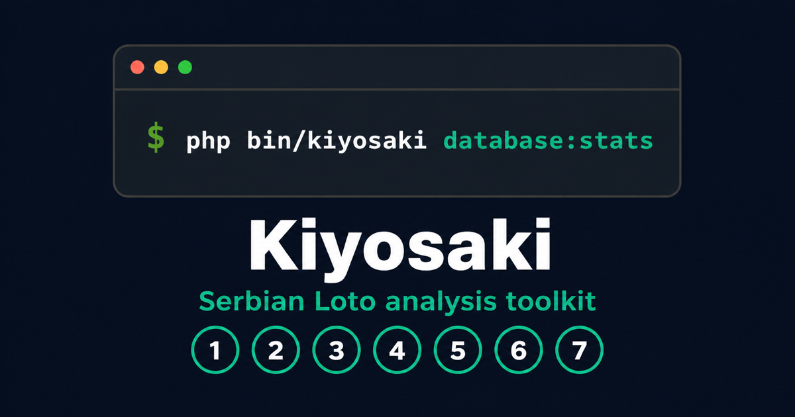

# Kiyosaki

[](https://github.com/zlatanstajic/kiyosaki/actions/workflows/check.yml)
[](LICENSE.md)
[](composer.json)
[](https://www.php.net/)
[](https://zlatanstajic.github.io/kiyosaki/)

> Serbian Loto history, constrained generation and result analysis.

Kiyosaki is a dependency-free PHP 8.5 library and command-line application for
the Serbian Loto 7/39 game. It stores official draw history in SQLite, ranks
number frequencies, generates bounded combinations and measures saved
combinations against later results.

The bundled database contains 1,477 draws from 2012 through draw 21 of 2026 and
140 generated combinations.

> Lottery draws are random. Historical frequencies and selection filters do
> not improve the mathematical odds of a valid combination. Kiyosaki provides
> reproducible analysis and selection tools, not predictions.



## Table of Contents

- [Features](#features)
- [Tech Stack](#tech-stack)
- [Install](#install)
  - [Requirements](#requirements)
  - [From Source](#from-source)
- [Command-Line Usage](#command-line-usage)
  - [Inspect](#inspect)
  - [Generate](#generate)
  - [Analyse](#analyse)
  - [Scrape](#scrape)
  - [Configuration](#configuration)
- [Library Usage](#library-usage)
- [Library Reference](#library-reference)
  - [Core](#core)
  - [System](#system)
  - [Console](#console)
  - [Error Handling](#error-handling)
- [Database](#database)
- [Examples](#examples)
- [Documentation](#documentation)
- [Development](#development)
  - [Coding Standard](#coding-standard)
  - [Spelling](#spelling)
  - [Automated Refactoring](#automated-refactoring)
  - [Static Analysis](#static-analysis)
- [Testing](#testing)
  - [Test Isolation](#test-isolation)
  - [Pre-commit Hook](#pre-commit-hook)
- [Security](#security)
- [Contributing](#contributing)
- [License](#license)

---

## Features

- **Complete workflow:** Scrape official results, generate selections, store
  them and evaluate them when their target draw becomes available.
- **Bundled history:** Start with 1,477 imported draws and 140 stored
  combinations instead of an empty database.
- **Constrained generation:** Exclude frequent numbers, require infrequent or
  favourite numbers and reject prior draws, duplicates and dense patterns.
- **Bounded execution:** Impossible generation rules fail after a configured
  number of attempts instead of recursing indefinitely.
- **Frequency analysis:** Rank all 39 numbers deterministically from stored draw
  history.
- **Honest success rates:** Use every evaluated combination as the denominator
  and report combinations whose target result is still pending.
- **Official-result imports:** Fetch the current `lutrija.rs/api/results` JSON
  contract, cache one response per year and skip existing draws.
- **Replaceable storage:** Use the committed SQLite file by default or point the
  application at another database with one environment variable.
- **Dependency-free runtime:** Only PHP platform extensions are required; no
  framework or third-party runtime package is installed.
- **Composer-ready:** PSR-4 autoloading and an installable `kiyosaki` binary are
  declared in [composer.json](composer.json).

[⬆ back to top](#table-of-contents)

---

## Tech Stack

- **Language:** PHP 8.5
- **Storage:** SQLite through PDO, with JSON columns for lists and nested result
  metadata
- **HTTP:** cURL against the official Serbian lottery results API
- **Testing:** Pest with a required minimum line coverage of 80%
- **Quality:** Laravel Pint, Peck, Rector and PHPStan at level 8
- **Documentation:** Sphinx with MyST, published to GitHub Pages
- **Automation:** GitHub Actions for checks, coverage artifacts and
  documentation deployment

[⬆ back to top](#table-of-contents)

---

## Install

### Requirements

- PHP 8.5
- Composer 2
- PHP extensions: cURL, JSON, PDO and PDO SQLite
- PCOV or Xdebug, only to run the coverage-enforced test suite
- `aspell` and an English dictionary, only to run the spell checker

| PHP | Production | Development |
|---|---|---|
| 8.5 | Yes | Yes |

### From Source

Clone the repository and install its development dependencies:

```bash
git clone https://github.com/zlatanstajic/kiyosaki.git
cd kiyosaki
composer install
php bin/kiyosaki database:stats
```

`composer install` also configures the version-controlled pre-commit hook
described under [Testing](#pre-commit-hook). In this checkout, run the binary as
`php bin/kiyosaki`; projects that install Kiyosaki as a Composer package receive
the usual `vendor/bin/kiyosaki` proxy.

[⬆ back to top](#table-of-contents)

---

## Command-Line Usage

Run `php bin/kiyosaki help` to print the available commands. Successful
commands return exit code `0`, operational failures return `1`, and unknown
commands return `2`.

### Inspect

Display the draw range, draw count, generated-combination count and active
database path:

```bash
php bin/kiyosaki database:stats
```

`stats` is an alias for `database:stats`.

### Generate

Generate five unique combinations for the draw after the latest stored result:

```bash
php bin/kiyosaki generate --combinations 5
```

Combine historical frequency filters with favourite numbers:

```bash
php bin/kiyosaki generate \
  --combinations 5 \
  --disable-most 3 \
  --enable-least 2 \
  --favorites 7,13,21
```

| Option | Short | Purpose |
|---|---|---|
| `--combinations` | `-c` | Number of combinations to generate; defaults to `1` |
| `--disable-most` | `-d` | Exclude this many of the most frequent numbers |
| `--enable-least` | `-e` | Require this many of the least frequent numbers |
| `--favorites` | `-n` | Require a comma-separated number list |
| `--draw` | `-id` | Override the target draw number |
| `--year` | `-y` | Override the target year |

Every generated combination contains seven unique numbers from 1 through 39.
The generator rejects stored draws, duplicates, runs of three consecutive
numbers and arithmetic patterns with three equal adjacent differences.

### Analyse

Score every stored combination whose target result is available:

```bash
php bin/kiyosaki analyse --year 2026
```

The report lists matches from three through seven and reports selections whose
target draw is still missing. `analyze` is accepted as an alias.

### Scrape

Import a range from the official results service:

```bash
php bin/kiyosaki scrape --year 2026 --start 22 --end 30
```

Existing draws are skipped before a request is parsed or inserted. The client
caches a year's API response for the lifetime of the command.

### Configuration

Kiyosaki reads one optional environment variable:

| Variable | Purpose |
|---|---|
| `KIYOSAKI_DATABASE_PATH` | Replace the default `database/kiyosaki.sqlite` path |

The schema is created automatically when the configured database is new.
Kiyosaki does not read a `.env` file.

[⬆ back to top](#table-of-contents)

---

## Library Usage

Composer provides the autoloader. The example below ranks historical numbers
and generates five selections from the same draw history:

```php
<?php

require __DIR__.'/vendor/autoload.php';

use Kiyosaki\Core\Generation\CombinationGenerator;
use Kiyosaki\Core\Statistics\FrequencyAnalyzer;
use Kiyosaki\System\Storage\Database;

$database = new Database;
$draws = $database->draws();
$frequencies = (new FrequencyAnalyzer)->extremes($draws, 3);

$combinations = (new CombinationGenerator)->generate(
    previousCombinations: array_map(
        static fn ($draw): array => $draw->numbers,
        $draws,
    ),
    totalCombinations: 5,
    disabledNumbers: array_column($frequencies['most'], 'number'),
    enabledNumbers: array_column($frequencies['least'], 'number'),
);
```

[⬆ back to top](#table-of-contents)

---

## Library Reference

Kiyosaki has three layers. `src/Core/` contains public domain records and use
cases, `src/System/` owns volatile infrastructure, and `src/Console/` translates
command arguments and failures into terminal output.

### Core

| Namespace | Classes | Purpose |
|---|---|---|
| `Kiyosaki\Core\Domain` | `DrawRecord`, `StoredCombination` | Immutable, validated records for results and saved selections |
| `Kiyosaki\Core\Generation` | `CombinationGenerator` | Bounded, filtered generation of unique 7/39 combinations |
| `Kiyosaki\Core\Statistics` | `FrequencyAnalyzer` | Deterministic most/least frequency rankings |
| `Kiyosaki\Core\Analysis` | `SuccessRateAnalyzer` | Match details, rates and pending-result counts |
| `Kiyosaki\Core\Import` | `DrawImporter` | Coordinates result retrieval, parsing and persistence |

### System

| Namespace | Classes | Purpose |
|---|---|---|
| `Kiyosaki\System\Storage` | `Database` | SQLite location, schema, queries and transactions |
| `Kiyosaki\System\Scraping` | `ResultsClient`, `CurlResultsClient` | Replaceable retrieval contract and official HTTP client |
| `Kiyosaki\System\Scraping` | `LotteryResultsParser` | Validation and translation of the current JSON result contract |

### Console

| Namespace | Class | Purpose |
|---|---|---|
| `Kiyosaki\Console` | `Application` | Command parsing, output, aliases and process exit codes |

### Error Handling

Invalid domain state, malformed options, impossible generation rules, storage
failures and result-service failures use exceptions. Library consumers may
catch the relevant standard exception type. The CLI catches every throwable,
writes a concise message to standard error and returns a non-zero exit code.

[⬆ back to top](#table-of-contents)

---

## Database

[database/kiyosaki.sqlite](database/kiyosaki.sqlite) is committed application
data. The bundled snapshot contains:

- 1,477 draws from 2012 through draw 21 of 2026;
- 140 generated combinations;
- exactly seven unique values in every stored number list;
- JSON prize and payment metadata from the source database;
- lookup indexes for `(year, draw)` in both tables.

The snapshot ends on 13 March 2026 and is not automatically synchronized. Use
the `scrape` command to import later results. Tests never write to this file.
The schema and storage details are documented in
[docs/database.md](docs/database.md). The data source and third-party rights
notice are in [THIRD_PARTY_NOTICES.md](THIRD_PARTY_NOTICES.md).

[⬆ back to top](#table-of-contents)

---

## Examples

Runnable examples live under [examples](examples/):

```bash
php examples/simple-generation.php
php examples/frequency-analysis.php
php examples/constrained-generation.php
```

The examples are included in Pint, Rector and PHPStan checks so they remain
synchronized with the public API.

[⬆ back to top](#table-of-contents)

---

## Documentation

The published documentation lives at
**<https://zlatanstajic.github.io/kiyosaki/>** and covers installation, CLI
usage, architecture, storage and licensing.

Sources are the MyST Markdown files under [docs](docs). GitHub Actions rebuilds
and publishes them on every push to `master`. To build them locally:

```bash
python -m pip install --requirement docs/requirements.txt
sphinx-build --fail-on-warning --builder html docs docs/_build/html
```

[⬆ back to top](#table-of-contents)

---

## Development

Run every PHP quality gate in one command:

```bash
composer run check
```

The command runs the coding standard, spell checker, Rector dry run, static
analysis and tests. Pull requests and pushes to `master` run the same sequence
in GitHub Actions.

### Coding Standard

Kiyosaki follows the default Laravel coding standard through Laravel Pint. No
custom `pint.json` is present.

```bash
# Check without changing files
composer run lint

# Apply formatting
composer run fix
```

Both commands cover `src/`, `tests/`, `bin/` and `examples/`.

### Spelling

Comments, identifiers, documentation and file names are checked with Peck:

```bash
composer run peck
```

Peck shells out to `aspell`. Technical terms that should not be changed belong
in [peck.json](peck.json).

### Automated Refactoring

Rector checks production code, tests, the binary and examples against the PHP
version declared in Composer:

```bash
# Preview required changes
composer run rector

# Apply configured changes
composer run rector:fix
```

The configuration lives in [rector.php](rector.php).

### Static Analysis

PHPStan runs at level 8 over `src/`, `bin/` and `examples/`:

```bash
composer run phpstan
```

The configured rules are in [phpstan.neon](phpstan.neon).

[⬆ back to top](#table-of-contents)

---

## Testing

Kiyosaki uses Pest as its test runner. Every run enforces at least 80% line
coverage and writes HTML, Clover XML and text reports under `build/`:

```bash
composer run test
```

`composer run coverage` is an alias for the same command. During development,
run the smallest relevant test first:

```bash
vendor/bin/pest tests/Core/ModernPipelineTest.php
vendor/bin/pest --filter "generator produces unique filtered combinations"
```

The PHPUnit configuration lives in [phpunit.xml](phpunit.xml).

### Test Isolation

- Write tests create uniquely named SQLite files under the system temporary
  directory and remove them afterward.
- The committed database is queried only to verify the imported record counts.
- HTTP behavior uses injected transports and in-memory responses; the test
  suite never calls the real lottery service.
- The coverage and documentation output directories are ignored by Git.

### Pre-commit Hook

The version-controlled hook at
[`.githooks/pre-commit`](.githooks/pre-commit) runs `composer check` before
each commit. Composer installs it after dependency installs and updates. To
install or refresh it explicitly:

```bash
composer run hooks:install
```

A failing check aborts the commit. Run `composer run check` directly to
reproduce it. Bypass the hook only when necessary with
`git commit --no-verify`.

[⬆ back to top](#table-of-contents)

---

## Security

Report suspected vulnerabilities privately through
[GitHub's security advisory form](https://github.com/zlatanstajic/kiyosaki/security/advisories/new).
Please do not disclose a vulnerability in a public issue before a fix is
available. See [SECURITY.md](SECURITY.md) for the supported-version policy and
reporting details.

[⬆ back to top](#table-of-contents)

---

## Contributing

Contributions are welcome. Open an issue before starting a change and branch
from `master` using `issues/<number>-<kebab-case-description>`. Pull requests
must keep the PHP and documentation gates green and preserve the 80% coverage
minimum. See [CONTRIBUTING.md](CONTRIBUTING.md) for the architecture, database
and workflow rules.

[⬆ back to top](#table-of-contents)

---

## License

Kiyosaki is open-source software licensed under the
[MIT License](LICENSE.md). Copyright (c) Zlatan Stajic
<contact@zlatanstajic.com>.

[⬆ back to top](#table-of-contents)
